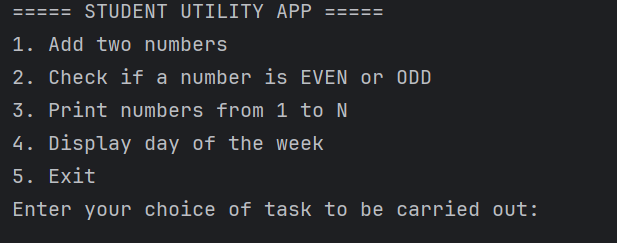
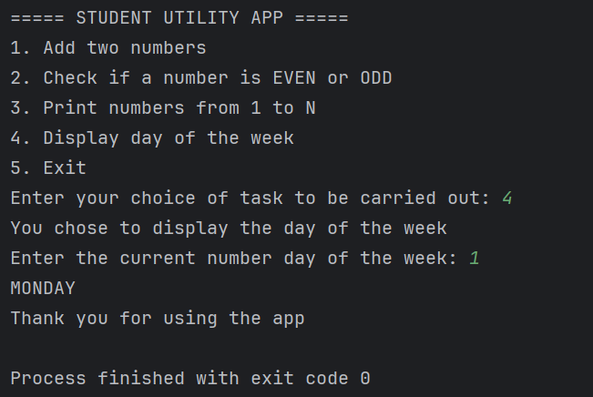

# STUDENT UTILITY APP

This is a console based Java application that enables a student to perform one out of a set of listed tasks.

## APPLICATION USAGE

Upon starting the application, a menu is displayed showing a list of available tasks that can be carried out after which
the student is prompted to enter a preferred option. 

**N.B.:** The student is expected to enter the selected option as an integer value from 1 to 5.

After the student has inputted the preferred choice, then the student is to follow the set of prompts peculiar to the 
selected option before arriving at a final output. See sample below:

### AUTHOR NAME

Joseph Olukunle